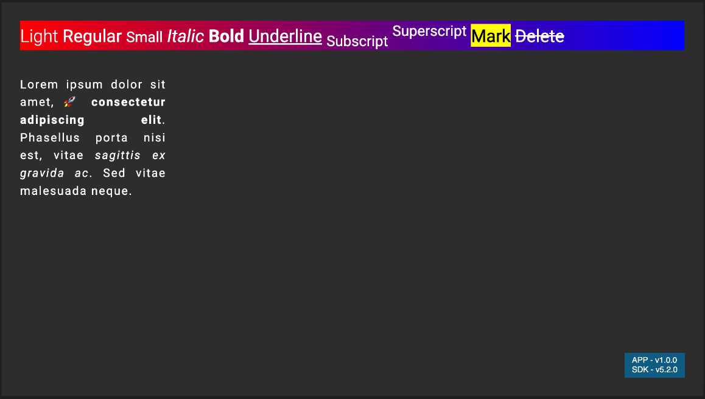

# HTML Text

This (very rough) demo shows how you can use SVGs to render HTML text. I saw this technique used in [pixi.js](https://github.com/pixijs/html-text) and wondered if it could be applied in Lightning.



### Getting started

> Before you follow the steps below, make sure you have the
> [Lightning-CLI](https://rdkcentral.github.io/Lightning-CLI/#/) installed _globally_ only your system

`npm install -g @lightningjs/cli`

#### Running the App

Use `lng dev` to start the watcher and run a local webserver / open the App in a browser _at the same time_

### How it works

A [custom font loader](https://github.com/lewispeel/lightning-html-text/blob/main/src/index.js#L18) is needed to converted each font file to a Base64 encoded string as they're loaded into the browser.

The [`HTMLText`](https://github.com/lewispeel/lightning-html-text/blob/main/src/HTMLText.js) component uses [`<foreignObject>`](https://developer.mozilla.org/en-US/docs/Web/SVG/Element/foreignObject) to embed HTML into an SVG which is then drawn to a 2D canvas and attached to a Lightning texture.

#### Example

```
Justified: {
    x: 50,
    y: 200,
    htmlText:
        "Lorem ipsum dolor sit amet, &#x1F680; <b>consectetur adipiscing elit</b>. Phasellus porta nisi est, vitae <i>sagittis ex gravida ac</i>. Sed vitae malesuada neque.",
    style: {
        color: "white",
        "font-family": "Roboto",
        "font-size": "32px",
        "letter-spacing": "3px",
        "line-height": "48px",
        "max-width": "400px",
        "text-align": "justify",
        "text-shadow": "1px 2px black",
        "word-wrap": true,
    },
    type: HTMLText,
},
```

### Disclaimer

I haven't tested this very much and there's probably a lot of work to make this production-ready, so I wouldn't use this for anything other than demos.
